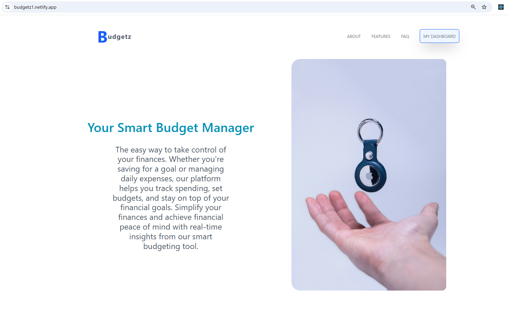
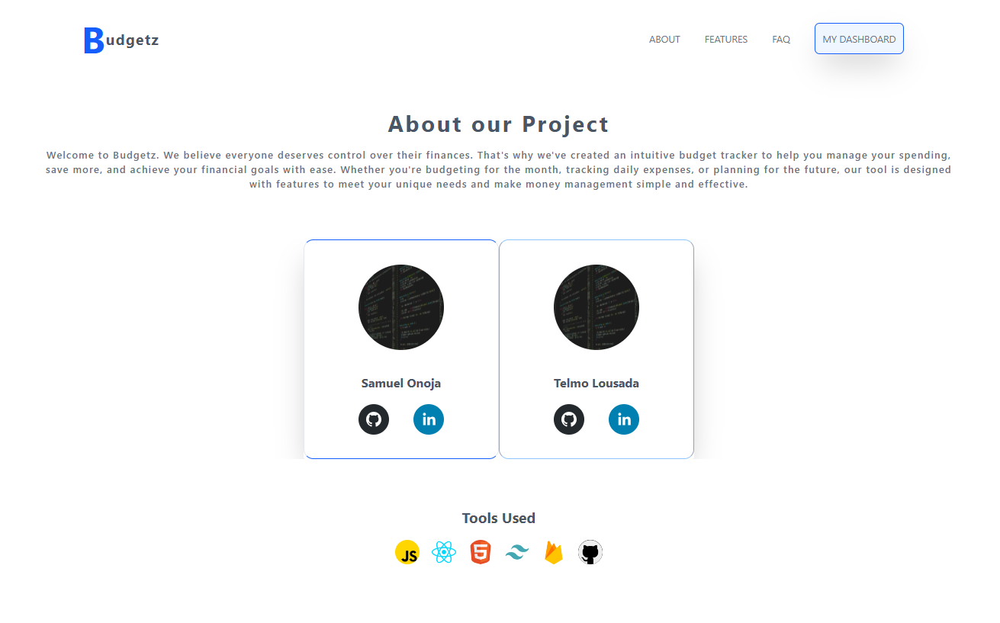
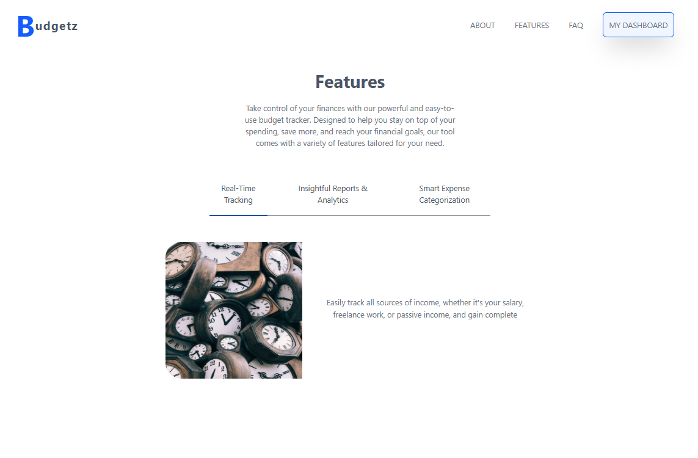
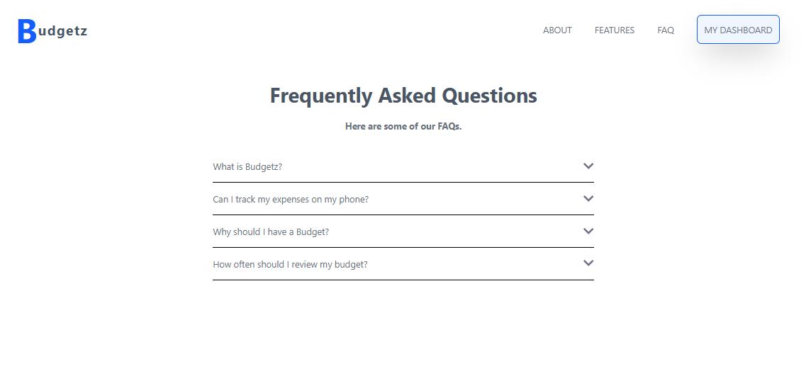
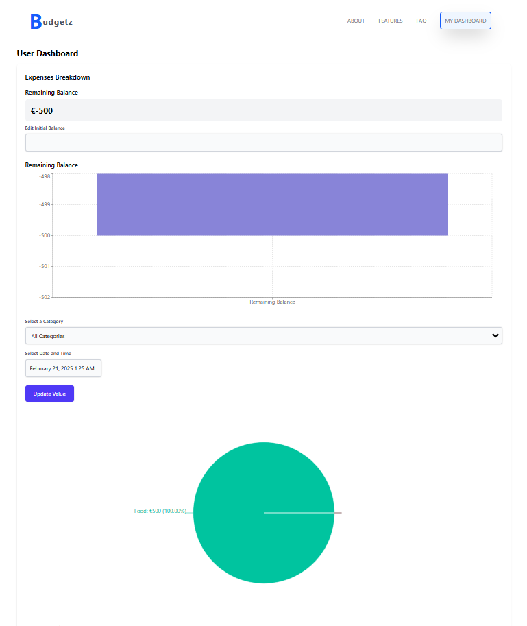

# Budgetz

## Description

#### Budgetz is a budget tracker to help you manage your spending, save more, and achieve your financial goals with ease. Whether you're budgeting for the month, tracking daily expenses, or planning for the future, our tool is designed with features to meet your unique needs and make money management simple and effective.

## Dependencies used & How To Install

1. ### react-social-icons (used to get icons of websites like linkedin, git etc.)
   - ### npm i react-social-icons
2. ### react-datepicker (this enables proper use of date and time.)
   - ### npm i react-social-icons
3. ### tailwind (here you'll find the official doc https://tailwindcss.com/docs/installation/using-vite)
   

## Demo

Checkout the final version, visit the live demo here: 
[Demo Link](https://budgetz1.netlify.app/)